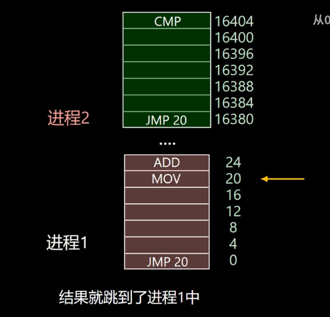
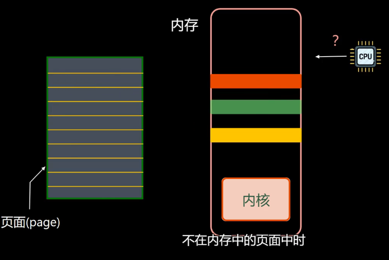
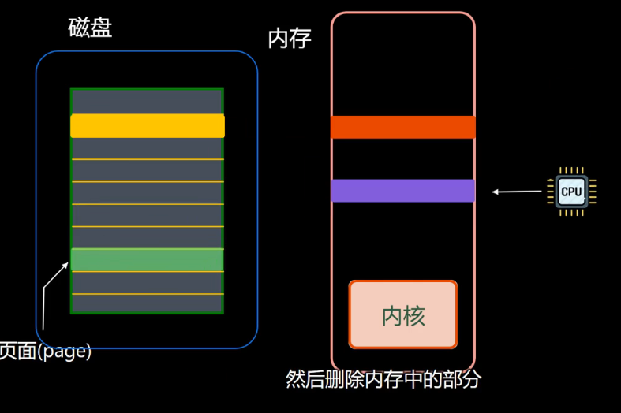
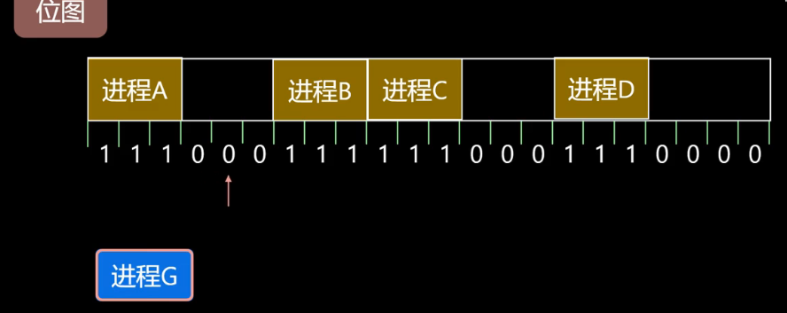
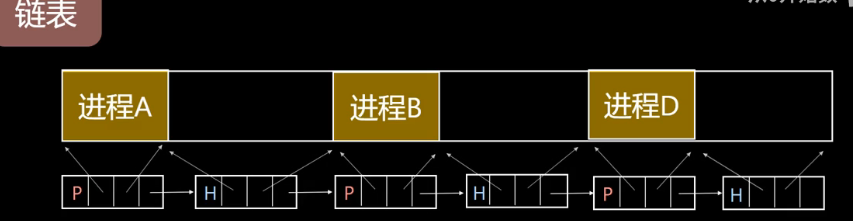

### 系统的内存分为三大块
#### 高速缓存
临时存储，存储的容量特别小kb，分为l1 cache、l2 cache、l3 cache  
读取速度最快，但是相对价格昂贵

#### 内存（进程）
临时存储，存储的容量中等GB，读取速度较快，价格适中

#### 磁盘
永久存储，分为SSD（固态硬盘）和HDD（机械硬盘），容量大TB，便宜，但是访问的很慢  
以机械硬盘为例，是将数据刻在机械硬盘里，查询起来也很慢。SSD相对好点，是许多闪存颗粒以及芯片组成，查找时间快  

---

内存中每个内存单元大小为1字节（8比特），都有一个对应的地址（物理地址）  
多进程在执行的时候，内存可能存在紊乱的情况，进程2可能跳转到进程1的地址去了，如下图所示

#### 内存管理多进程
1. 多个进程独立  
    程序指令中的地址不能是物理地址，而是进程内部的相对地址
2. 进程保护  
    当有进程要访问不是自己范围的地址的时候，操作系统需要保护，需要一种存储器抽象--称为地址空间

---

#### 寄存器
CPU配备了两个寄存器，一个是基址寄存器，一个是界限寄存器  
简单理解就是基址寄存器记录了每个进程的头地址是多少，界限寄存器记录了每个进程的地址长度是多少  
这样在头地址的前提下，进行相对的地址移动，就能防止上述的问题  

---

#### swap技术
问题1：假如此时内存有限，但是进程数量庞大，就需要进行内存空间的管理和交换  
我们有许多进程在磁盘中等待被调用，但是内存大小就那么大，当我们内存不够的时候，想继续打开进程  
那么系统会自动把暂时不适用的进程交换回磁盘，来提供足够的内存空间。这种技术叫做swap（类似于手机的杀死后台、程序墓碑机制）

#### 内存紧缩
问题2：在交换的过程中，会出现许多内存的间隙，例如尼尔机械纪元里填装芯片的时候，会出现有些空隙太小了，放不下其他芯片  
这个时候就需要利用碎片化的内存区域，需要把所有进程尽可能向下移动，这个技术称为内存紧缩。但是需要耗费大量CPU时间。  

更好的方法：**虚拟内存**  
这里再提出一个问题：假如一个进程需要的内存很大，而且在使用的时候占用的内存还会增多，最终会爆掉内存。  
更好的解决方法：将这个进程切碎存放在磁盘、分成一个一个小单元（称为一个页面），其中只有一部分的页面在内存中  
CPU访问的地址不在内存中的页面时，可以从磁盘中加载对应的部分  
内存不够时，也可以把长期不使用的页面移动保存到磁盘中（即将进程碎片化操作）  

将虚拟地址转成物理地址（需要通过页表来映射，同时需要内存管理单元MMU来解析）  
虚拟地址 ---> 物理地址（最小单位为页框）
---

#### 位图和链表管理内存
**位图**

如上图所示，位图将占用内存的进程部分标识为1，空余的区域表示为0.当另外的进程要加入其中时  
会去从前向后寻找连续为0的区域作为进程的内存区域。（但是耗时）

**链表**

如上图所示，链表在每一块连续的区域都有一个节点来表示  
第一个值：P表示这块区域以及有进程在占用；H表示这块区域空闲  
第二个值：指向了这个对应连续区域的起始位置  
第三个值：指向了这个对应连续区域的终止位置  
第四个值：是一个指针，指向了下一个节点  
这时有一个进程想要加载，就从头扫描。直到找到一块长度适合的连续区域（首次适配算法）  
除此之外还有最佳适配算法，就是找出大小最佳的那块区域（贪心）  
想要移除进程也很简单，直接将这个节点移除，更新前一个节点的第三个值和第四个值即可