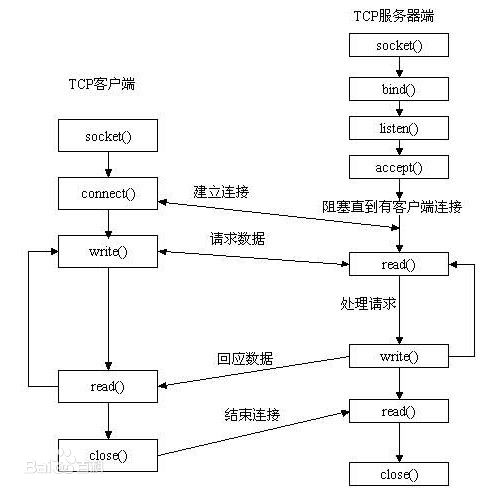

### socket()
#### 什么是socket()
本地的进程的通信有：  

* 消息传递（管道，First in first out，消息队列）  
* 同步（互斥量，条件变量，读写锁，信号量等）
* 共享内存（shared memory）
* 远程过程调用  

网络中进程之间的通信  
用socket进行  

---
#### socket基本操作
一般来说要使用socket，需要一个服务器和一个客户端  
两者都需要调用socket函数  
* 对于服务器：  
  bind()函数， 把一个地址族中特定的地址赋给socket，通常在服务器启动的时候就会绑定一个地址，用于提供服务  
  客户不用指定，因为客户端在连接的时候会自动分配地址  
  
  listen()函数，监听这个socket，如果此时客户端发送连接请求，服务端就会收到这个连接请求  
  
  accept()函数，TCP服务器端调用这个函数接收客户端发送的连接请求，之后就可以开始网络I/O操作

* 对于客户端：  
  connect()函数，向服务端发送连接请求

* 对于两端：  
  read()函数，负责从fd读取内容，read返回实际所读的字节数，如果返回值为0表示读到的文件结束，小于0说明读取错误  
  
  write()函数，将buf中的字节内容写入到文件描述符fd，成功时返回写的字节数,失败返回-1  
  
  close()函数，在服务器与客户端建立连接之后，如果需要关闭socket，就可以使用此函数  
---
#### 运作原理
