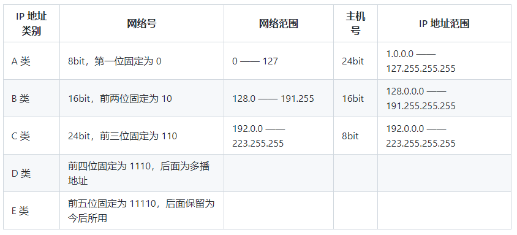
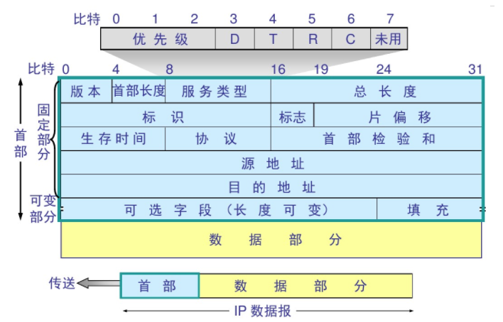
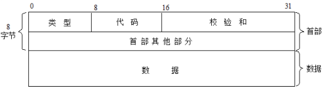

### 网络层
#### 将数据设法从源端经过若干个中间节点传送到目的端，负责选择最佳路径，规划ip地址

---

* IP（Internet Protocol，网际协议）是为计算机网络相互连接进行通信而设计的协议。
* ARP（Address Resolution Protocol，地址解析协议）
* ICMP（Internet Control Message Protocol，网际控制报文协议）
* IGMP（Internet Group Management Protocol，网际组管理协议）

IP国际协议：  

IP地址分类：  

IP数据报格式：  

ICMP网际控制报文协议：  
一般来说，ICMP报文提供针对网络层的错误诊断、拥塞控制、路径控制和查询服务四项大的功能。  
  

各种各样的协议从一个源端输入到另外一个接收端，要保证输入输出的接口一致  
利用同样的协议来解析发送过来的数据报文，解析这些信息  
其中这些信息就如同发送一个包裹  
在这个包裹中会显示什么时候发出的包裹，发送的快递是哪一家的  
收件人的详细信息，寄件人的详细信息，包裹里面是什么内容，是否是加急件等。。。  
以上这些信息就是数据报文的首部，不同协议，这些信息的排列可能不同  
数据部分就是包裹里面的内容，需要识别之后转换成相对于的信息  

---

TCP协议：  
网络接口层（接口）：将网络层的数据发送出去  

网络层：负责相邻计算机之间的通信，将信息装入ip数据报，填充报头，选择合适路径发送；处理输入的报头；处理路径、流控、拥塞问题  

传输层：提供应用程序间的通信。其功能包括：一、格式化信息流；二、提供可靠传输。  

应用层：应用层是向用户提供一组常用的应用程序，比如电子邮件、文件传输访问、远程登录等。 