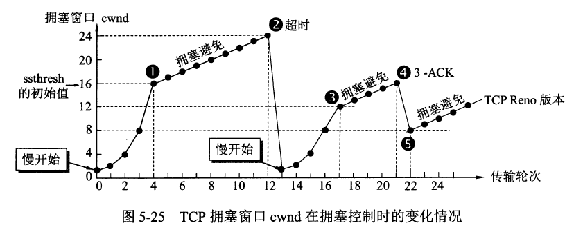
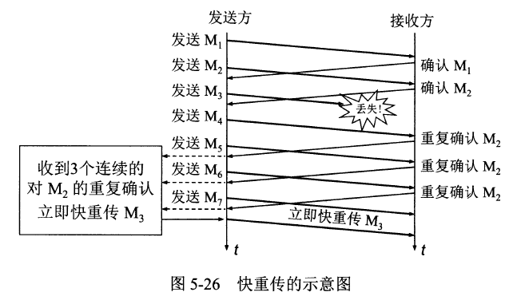

### 传输层
#### 主要负责向两个主机中进程之间的通信提供服务
#### 可靠传输(TCP)，流量控制，不可靠传输(UDP)

---

#### TCP
是一种面向连接的、可靠的、基于字节流的传输层通信协议，其传输的单位是报文段。  
特征：  
1. 面向连接
2. 点对点通信
3. 可靠交互
4. 全双工通信
5. 面向字节流

如何保证可靠传输：
1. 确认和超时重传
2. 数据合理分片和排序
    * TCP黏包问题：  
TCP是基于字节流的传输服务，数据没有边界，可能会出现两个数据包黏在一起的情况  
   * 解决方案：  
     1. 发送定长包，每个消息长度大小一样
     2. 包头加上包体长度
     3. 在数据包之间设置边界，添加特殊符号
     4. 使用更复杂的应用层协议
3. 流量控制
    * 控制流量，让发送方发送的速率不要过快，利用可变窗口进行流量控制
4. 拥塞控制
    * 拥塞控制就是防止过多的数据注入到网络中，这样可以使网络中的路由器或链路不致过载。
    * 解决办法：
      1. 慢开始
      2. 拥塞避免
      3. 快重传
      4. 快恢复

  
5. 数据校验

---

TCP：状态控制码（Code，Control Flag），占 6 比特，含义如下：

URG：紧急比特（urgent），当 URG＝1 时，表明紧急指针字段有效，代表该封包为紧急封包。它告诉系统此报文段中有紧急数据，应尽快传送(相当于高优先级的数据)， 且上图中的 Urgent Pointer 字段也会被启用。  

ACK：确认比特（Acknowledge）。只有当 ACK＝1 时确认号字段才有效，代表这个封包为确认封包。当 ACK＝0 时，确认号无效。  

PSH：（Push function）若为 1 时，代表要求对方立即传送缓冲区内的其他对应封包，而无需等缓冲满了才送。  

RST：复位比特(Reset)，当 RST＝1 时，表明 TCP 连接中出现严重差错（如由于主机崩溃或其他原因），必须释放连接，然后再重新建立运输连接。  

SYN：同步比特(Synchronous)，SYN 置为 1，就表示这是一个连接请求或连接接受报文，通常带有 SYN 标志的封包表示『主动』要连接到对方的意思。  

FIN：终止比特(Final)，用来释放一个连接。当 FIN＝1 时，表明此报文段的发送端的数据已发送完毕，并要求释放运输连接。  


---

#### TCP 传输连接管理

TCP 三次握手建立连接  
  
```
【TCP 建立连接全过程解释】
1.客户端发送 SYN 给服务器，说明客户端请求建立连接；
2.服务端收到客户端发的 SYN，并回复 SYN+ACK 给客户端（同意建立连接）；
3.客户端收到服务端的 SYN+ACK 后，回复 ACK 给服务端（表示客户端收到了服务端发的同意报文）；
4.服务端收到客户端的 ACK，连接已建立，可以数据传输。

TCP 为什么要进行三次握手？
【答案一】因为信道不可靠，而 TCP 想在不可靠信道上建立可靠地传输，那么三次通信是理论上的最小值。
（而 UDP 则不需建立可靠传输，因此 UDP 不需要三次握手。）
【答案二】因为双方都需要确认对方收到了自己发送的序列号，确认过程最少要进行三次通信。
【答案三】为了防止已失效的连接请求报文段突然又传送到了服务端，因而产生错误。
```
TCP 四次挥手释放连接  

```
【TCP 释放连接全过程解释】

1.客户端发送 FIN 给服务器，说明客户端不必发送数据给服务器了（请求释放从客户端到服务器的连接）；
2.服务器接收到客户端发的 FIN，并回复 ACK 给客户端（同意释放从客户端到服务器的连接）；
3.客户端收到服务端回复的 ACK，此时从客户端到服务器的连接已释放（但服务端到客户端的连接还未释放，并且客户端还可以接收数据）；
4.服务端继续发送之前没发完的数据给客户端；
5.服务端发送 FIN+ACK 给客户端，说明服务端发送完了数据（请求释放从服务端到客户端的连接，就算没收到客户端的回复，过段时间也会自动释放）；
6.客户端收到服务端的 FIN+ACK，并回复 ACK 给服务端（同意释放从服务端到客户端的连接）；
7.服务端收到客户端的 ACK 后，释放从服务端到客户端的连接。

TCP 为什么要进行四次挥手？
【问题一】TCP 为什么要进行四次挥手？ / 为什么 TCP 建立连接需要三次，而释放连接则需要四次？
【答案一】因为 TCP 是全双工模式，客户端请求关闭连接后，客户端向服务端的连接关闭（一二次挥手），
服务端继续传输之前没传完的数据给客户端（数据传输），服务端向客户端的连接关闭（三四次挥手）。
所以 TCP 释放连接时服务器的 ACK 和 FIN 是分开发送的（中间隔着数据传输），而 TCP 建立连接时服务器的 ACK 和 SYN 是一起发送的（第二次握手），
所以 TCP 建立连接需要三次，而释放连接则需要四次。

【问题二】为什么 TCP 连接时可以 ACK 和 SYN 一起发送，而释放时则 ACK 和 FIN 分开发送呢？（ACK 和 FIN 分开是指第二次和第三次挥手）
【答案二】因为客户端请求释放时，服务器可能还有数据需要传输给客户端，因此服务端要先响应客户端 FIN 请求（服务端发送 ACK），
然后数据传输，传输完成后，服务端再提出 FIN 请求（服务端发送 FIN）；而连接时则没有中间的数据传输，因此连接时可以 ACK 和 SYN 一起发送。

【问题三】为什么客户端释放最后需要 TIME-WAIT 等待 2MSL 呢？
【答案三】为了保证客户端发送的最后一个 ACK 报文能够到达服务端。若未成功到达，则服务端超时重传 FIN+ACK 报文段，客户端再重传 ACK，并重新计时。
防止已失效的连接请求报文段出现在本连接中。TIME-WAIT 持续 2MSL 可使本连接持续的时间内所产生的所有报文段都从网络中消失，
这样可使下次连接中不会出现旧的连接报文段。
```
---

#### UDP
UDP（User Datagram Protocol，用户数据报协议）是 OSI（Open System Interconnection 开放式系统互联） 参考模型中一种无连接的传输层协议，  
提供面向事务的简单不可靠信息传送服务，其传输的单位是用户数据报。  

特征：
1. 无连接
2. 尽最大努力交付
3. 面向报文
4. 没有拥塞控制
5. 支持一对一，一对多，多对一，多对多的交互通信
6. 首部开销小

---

#### TCP和UDP的区别
1. TCP面向连接，UDP是无限连接
2. TCP提供可靠的服务，通过TCP传输的数据，无差错，不丢失，不重复，有序到达。UDP尽最大努力，不保证可靠交付
3. TCP通信信道全双工可靠信道，UDP不可靠信道
4. TCP点对点，UDP可以一对多，多对一，一对一，多对多
5. TCP传输的是字节流，可能出现黏包问题。UPD传输的是报文，没有这个问题
6. UDP没有拥塞控制，对于实时应用很有优势
7. TCP首部开销20字节，UDP首部开销8字节